# Tourism Agency Program

This project is the 2nd completion project of the Patika+ Full-Stack Developer Program. The technologies used in this project include:
- PostgreSQL
- Java
- JDBC
- Swing GUI

The main purpose of this project is to efficiently manage the daily operations of a business operating in the hotel sector and optimize customer reservation processes.

The Tourism Agency collaborates with various hotels to reserve rooms for customers. The person with admin authority, usually the developer, is initially recorded in the database by the programmer.

The person with admin authority can log into the system and add both admin and agency employees. Agency employees can record hotels and rooms in the system, perform room searches based on customer requests, and make reservation transactions. Customers do not have access to the system; they make reservations via phone or in person through agency employees.

Screenshots presentation of the project are provided below.

## Installation

1. Clone the project to your computer:

    ```bash
    git clone https://github.com/Mffedai/TourismAgency.git
    cd TourismAgency
    ```

2. Create the PostgreSQL database:

   - Use the `tourismAgency.sql` file in the `DB SQL` folder of the project to create a PostgreSQL database. You can enter the following command in the terminal or command prompt:

       ```bash
       psql -U admin -d tourismAgency -a -f "DB SQL/tourismAgency.sql"
       ```

     Here, `admin` is the PostgreSQL database user, and `tourismAgency` is the name of the database you want to create.

3. Compile and run the Java project:

    ```bash
    javac App.java
    java App
    ```

After following these steps, the application will run, and you can start by accessing the admin page. In this section, you can create new users for your admin and agency employees.

    Admin:
    Username: aa
    Password: aa
    
    Employee : 
    Username : Fatih Fedai
    Password : aa

## Screenshots

#### Shema:


#### Admin Page:
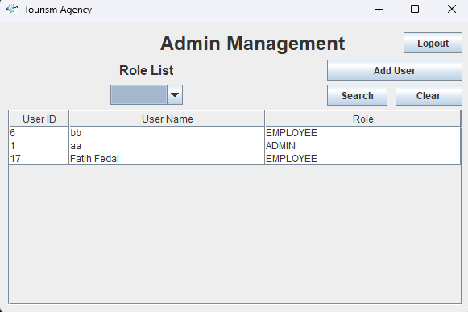

#### Hotel Management:
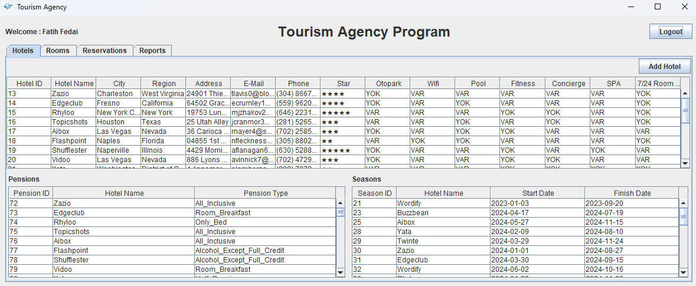

#### Room Management:
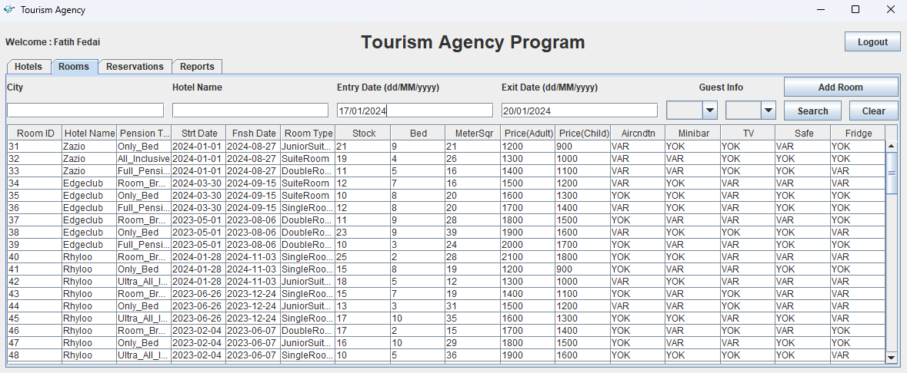

#### Reservation Management:
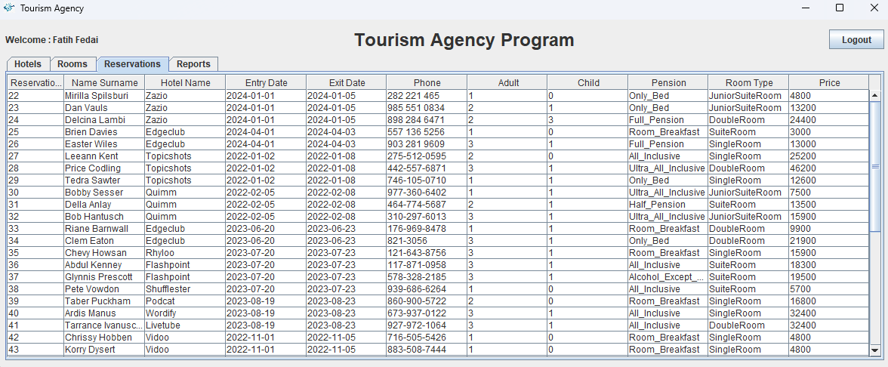

#### Report Management:


#### Line Chart:
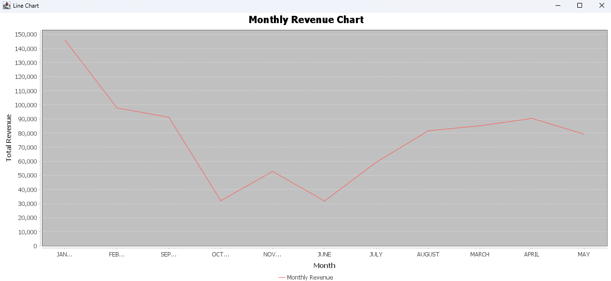

#### Pie Chart:
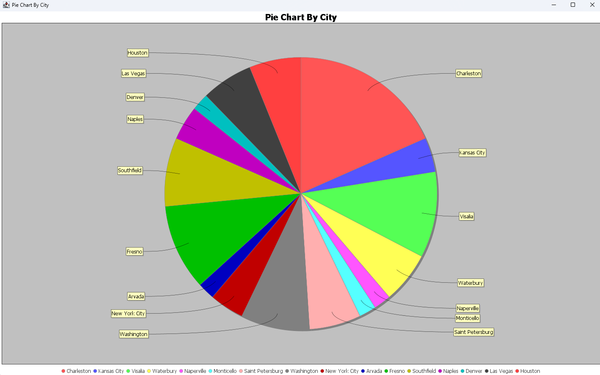

#### Candle Chart:
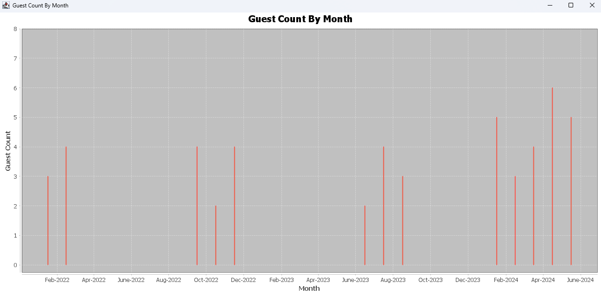

#### Hotel Adding Page:
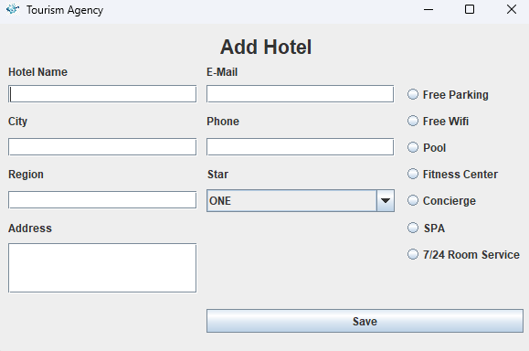

#### Pension Adding Page:
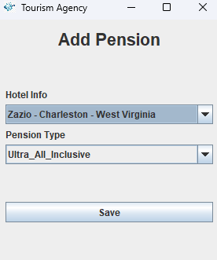

#### Season Adding Page:
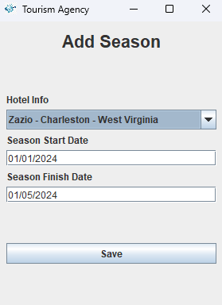

#### Room Adding Page:
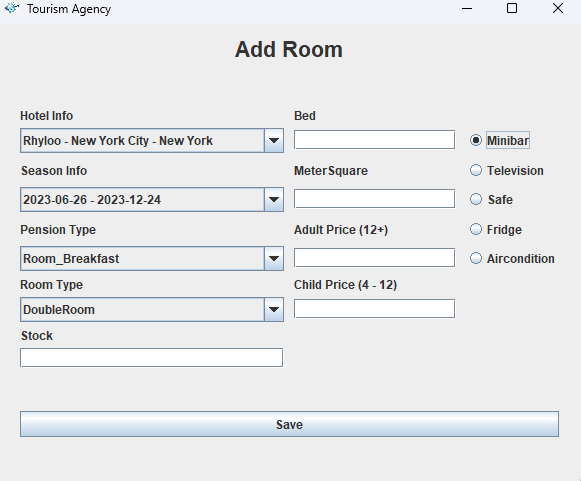

#### Reservation Adding Page:
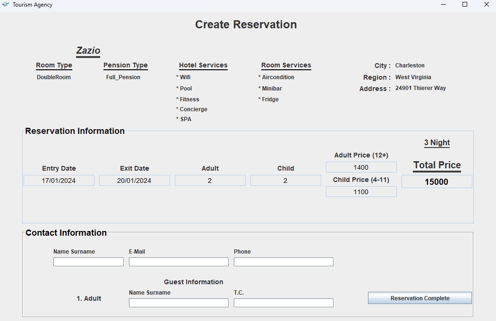

## 🔗 Links

[](https://www.linkedin.com/in/mehmet-fatih-fedai-ab011019a/)
